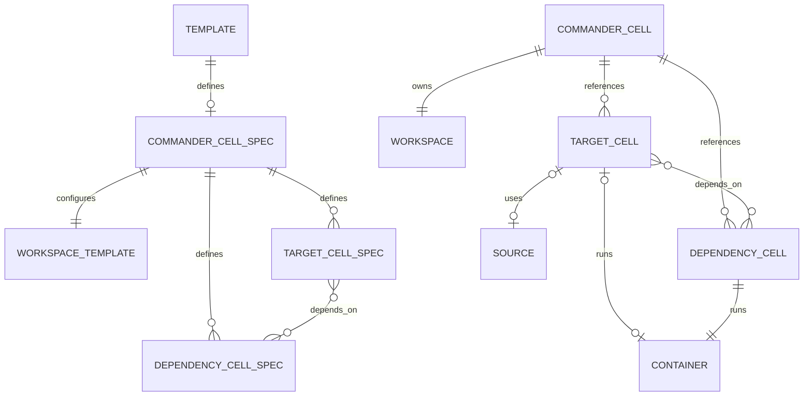

# Template and runtime cell model

The template describes runtime cells; only the CommanderCell is selected and
listed as a work item. TargetCell and DependencyCell are independent runtime
cells; the CommanderCell references them by ID and does not own or contain them.
This is a domain relationship diagram, not a statement about the SQLite storage
layout.

Every TargetCell has at least one of Source or Container, while either may be
present alone or both may be present. A DependencyCell has exactly one
dependency-mode Container. CommanderCell owns the shared Workspace and
workflow state; it is not the aggregate root of the target/dependency cells.
